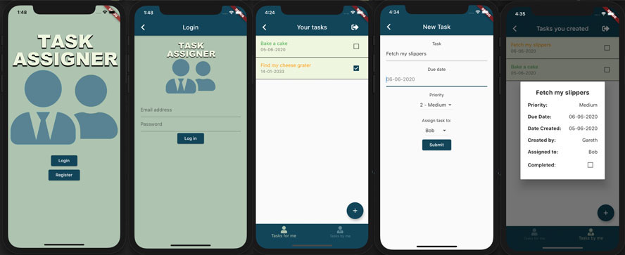

# TASK ASSIGNER

An app that lets you assign tasks to other users. 



## Technology
Built using Dart, Flutter and Firebase

## Current Features
- Sign up
- Log in
- See your tasks
- Add a new task
- Mark a task as complete
- View task details
- View status of tasks you have assigned
- Delete tasks
- Log out

## Features Yet To Be Added
- Push notification when a new task is assigned to you
- Alert before task deletion 
- Sort tasks by date
- Sort tasks by priority
- Error messages
- Password validation

## Packages Used
- [flutter_datetime_picker](https://pub.dev/packages/flutter_datetime_picker)
- [intl](https://pub.dev/packages/intl)
- [firebase_core](https://pub.dev/packages/firebase_core)
- [firebase_auth](https://pub.dev/packages/firebase_auth)
- [cloud_firestore](https://pub.dev/packages/cloud_firestore)
- [font_awesome_flutter](https://pub.dev/packages/font_awesome_flutter)
- [email_validator](https://pub.dev/packages/email_validator)

## Setup

To get the external libraries used:

```bash
$ flutter pub get
```


### Database

The GoogleService-Info.plist and google-services.json files required for Firebase have not been included in the repo. 

#### Firebase Authentication

Firebase authentication with e-mail and password has been set up for this app.

#### Tables

The database contains 2 tables. The fields used are as follows...

##### Users

| Field | Data Type | Notes |
|---|---|---|  
| uid | String | This is the same as the document id for the user in the auth table |
| name | String | | 
| created | Timestamp | |

##### Tasks

| Field | Data Type | Notes |
|---|---|---|  
| assigned_to | String | The uid of the user to whom the task is assigned |
| completed | Boolean | | 
| created | Timestamp | |
| created_by | String | The uid of the user who created the task |
| due_date | Timestamp | |
| priority | int | 1, 2, or 3 |
| task | String | |


